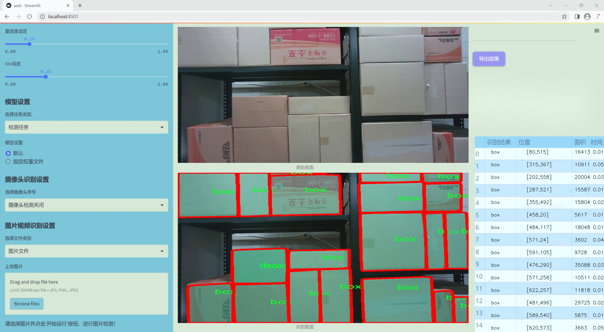
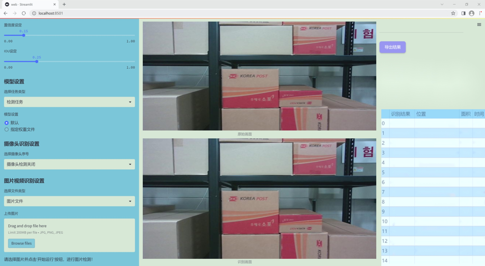
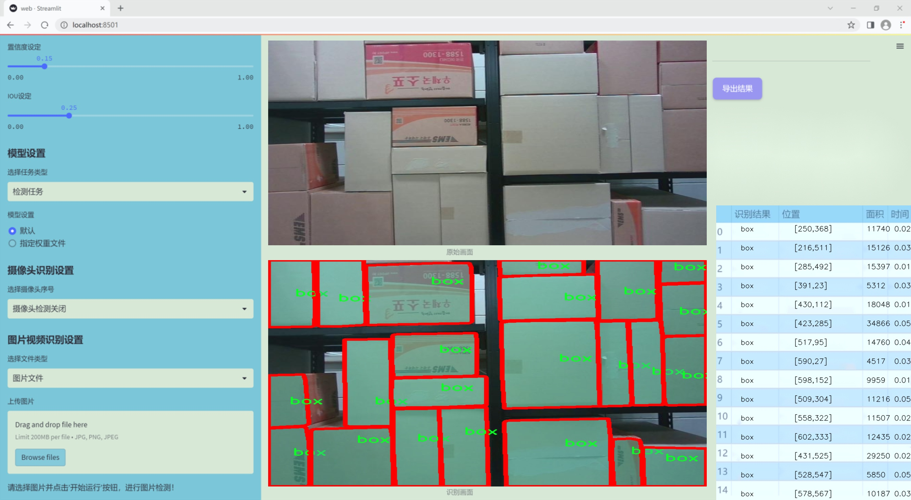
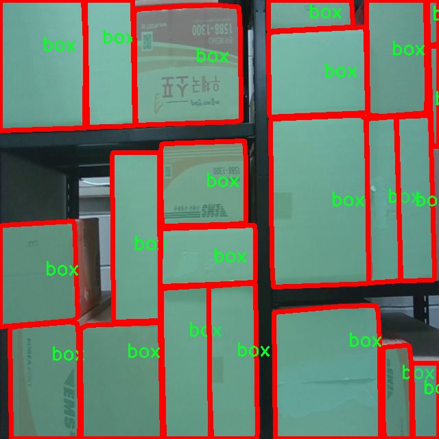
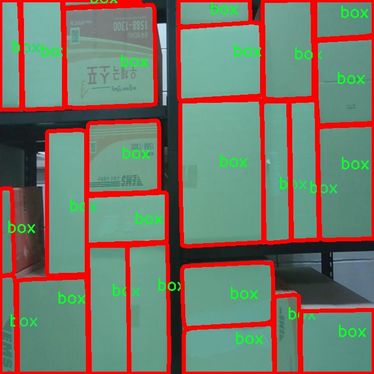
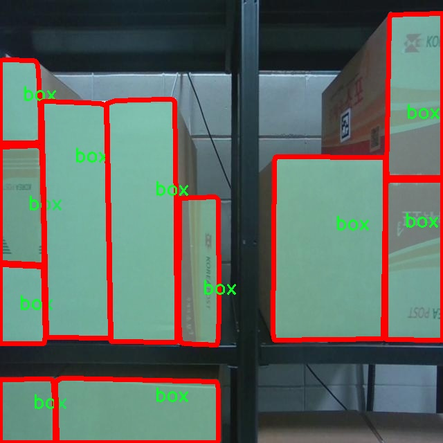
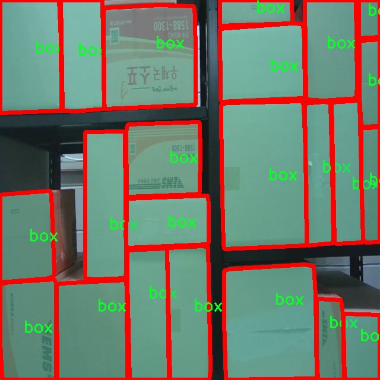
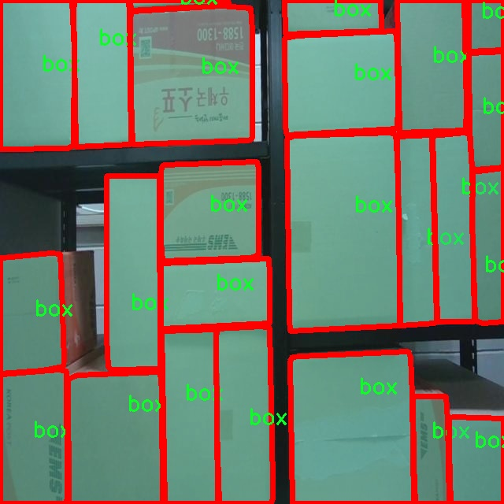

### 1.背景意义

研究背景与意义

随着电子商务的迅猛发展，纸箱作为物流和运输中不可或缺的包装材料，其检测和管理的重要性日益凸显。纸箱的种类繁多，形状和尺寸各异，如何高效、准确地识别和分类这些纸箱，成为了计算机视觉领域亟待解决的挑战之一。传统的纸箱检测方法往往依赖于人工识别，效率低下且容易受到人为因素的影响，无法满足现代物流行业对自动化和智能化的需求。因此，基于深度学习的自动检测系统应运而生，尤其是以YOLO（You Only Look Once）系列模型为基础的实例分割技术，因其在实时性和准确性上的优势，成为了研究的热点。

本研究旨在基于改进的YOLOv11模型，构建一个高效的纸箱检测系统。YOLOv11作为最新一代的目标检测模型，具备更强的特征提取能力和更快的推理速度，能够在复杂环境中实现对纸箱的精准识别。通过使用包含1300张标注图像的数据集，该系统将专注于纸箱的实例分割任务，力求在检测精度和处理速度上达到最佳平衡。数据集中仅包含一个类别的纸箱，尽管类别数量较少，但通过精细的标注和多样化的图像样本，模型仍然能够学习到丰富的特征，从而提升其在实际应用中的表现。

此外，随着计算机视觉技术的不断进步，纸箱检测系统的应用前景广阔。该系统不仅可以应用于仓储管理、物流配送等领域，还可以为智能制造、环境监测等提供支持。通过提高纸箱检测的自动化水平，能够有效降低人工成本，提高工作效率，进而推动整个行业的智能化转型。因此，本研究不仅具有重要的学术价值，也为实际应用提供了切实可行的解决方案。

### 2.视频效果

[2.1 视频效果](https://www.bilibili.com/video/BV1GRquYmEE3/)

### 3.图片效果







##### [项目涉及的源码数据来源链接](https://kdocs.cn/l/cszuIiCKVNis)**

注意：本项目提供训练的数据集和训练教程,由于版本持续更新,暂不提供权重文件（best.pt）,请按照6.训练教程进行训练后实现上图演示的效果。

### 4.数据集信息

##### 4.1 本项目数据集类别数＆类别名

nc: 1
names: ['box']


该项目为【图像分割】数据集，请在【训练教程和Web端加载模型教程（第三步）】这一步的时候按照【图像分割】部分的教程来训练

##### 4.2 本项目数据集信息介绍

本项目数据集信息介绍

本项目所使用的数据集专注于纸箱检测，特别是针对“cardboardbox_front”这一主题进行深入研究与应用。该数据集的设计旨在支持改进YOLOv11模型，以实现高效、准确的纸箱检测系统。数据集中包含的类别数量为1，具体类别为“box”，这意味着数据集的主要目标是识别和定位纸箱的前视图。通过聚焦于单一类别，数据集能够为模型提供更加专注和清晰的训练目标，从而提高检测精度和效率。

在数据集的构建过程中，研究团队精心挑选了多种不同场景下的纸箱图像，确保数据的多样性和代表性。这些图像不仅涵盖了不同尺寸、形状和颜色的纸箱，还包括了各种背景和光照条件下的拍摄情况。这种多样化的图像样本能够有效增强模型的泛化能力，使其在实际应用中能够更好地适应不同环境下的纸箱检测需求。

此外，数据集中的每一张图像都经过精确标注，确保模型在训练过程中能够学习到纸箱的特征信息。通过使用高质量的标注数据，模型能够更好地理解纸箱的形状、边缘和纹理等关键特征，从而提高其检测的准确性和鲁棒性。整体而言，本项目的数据集为改进YOLOv11的纸箱检测系统提供了坚实的基础，期待通过这一数据集的训练，能够实现更高效的纸箱识别与定位，为相关行业的自动化与智能化发展贡献力量。











### 5.全套项目环境部署视频教程（零基础手把手教学）

[5.1 所需软件PyCharm和Anaconda安装教程（第一步）](https://www.bilibili.com/video/BV1BoC1YCEKi/?spm_id_from=333.999.0.0&vd_source=bc9aec86d164b67a7004b996143742dc)


[5.2 安装Python虚拟环境创建和依赖库安装视频教程（第二步）](https://www.bilibili.com/video/BV1ZoC1YCEBw?spm_id_from=333.788.videopod.sections&vd_source=bc9aec86d164b67a7004b996143742dc)

### 6.改进YOLOv11训练教程和Web_UI前端加载模型教程（零基础手把手教学）

[6.1 改进YOLOv11训练教程和Web_UI前端加载模型教程（第三步）](https://www.bilibili.com/video/BV1BoC1YCEhR?spm_id_from=333.788.videopod.sections&vd_source=bc9aec86d164b67a7004b996143742dc)


按照上面的训练视频教程链接加载项目提供的数据集，运行train.py即可开始训练



     Epoch   gpu_mem       box       obj       cls    labels  img_size
     1/200     20.8G   0.01576   0.01955  0.007536        22      1280: 100%|██████████| 849/849 [14:42<00:00,  1.04s/it]
               Class     Images     Labels          P          R     mAP@.5 mAP@.5:.95: 100%|██████████| 213/213 [01:14<00:00,  2.87it/s]
                 all       3395      17314      0.994      0.957      0.0957      0.0843

     Epoch   gpu_mem       box       obj       cls    labels  img_size
     2/200     20.8G   0.01578   0.01923  0.007006        22      1280: 100%|██████████| 849/849 [14:44<00:00,  1.04s/it]
               Class     Images     Labels          P          R     mAP@.5 mAP@.5:.95: 100%|██████████| 213/213 [01:12<00:00,  2.95it/s]
                 all       3395      17314      0.996      0.956      0.0957      0.0845

     Epoch   gpu_mem       box       obj       cls    labels  img_size
     3/200     20.8G   0.01561    0.0191  0.006895        27      1280: 100%|██████████| 849/849 [10:56<00:00,  1.29it/s]
               Class     Images     Labels          P          R     mAP@.5 mAP@.5:.95: 100%|███████   | 187/213 [00:52<00:00,  4.04it/s]
                 all       3395      17314      0.996      0.957      0.0957      0.0845


###### [项目数据集下载链接](https://kdocs.cn/l/cszuIiCKVNis)

### 7.原始YOLOv11算法讲解


YOLO11 是 Ultralytics YOLO 系列的最新版本，结合了尖端的准确性、速度和效率，用于目标检测、分割、分类、定向边界框和姿态估计。与
YOLOv8 相比，它具有更少的参数和更好的结果，不难预见，YOLO11 在边缘设备上更高效、更快，将频繁出现在计算机视觉领域的最先进技术（SOTA）中。


**主要特点**

  * **增强的特征提取：**YOLO11 使用改进的主干和颈部架构来增强特征提取，以实现更精确的目标检测和复杂任务的性能。

  * **针对效率和速度优化：**精细的架构设计和优化的训练流程在保持准确性和性能之间最佳平衡的同时，提供更快的处理速度。

  * **更少的参数，更高的准确度：**YOLO11m 在 COCO 数据集上实现了比 YOLOv8m 更高的 mAP，参数减少了 22%，提高了计算效率，同时不牺牲准确度。

  * **跨环境的适应性：**YOLO11 可以无缝部署在边缘设备、云平台和配备 NVIDIA GPU 的系统上，确保最大的灵活性。

  * **支持广泛的任务范围：**YOLO11 支持各种计算机视觉任务，如目标检测、实例分割、图像分类、姿态估计和定向目标检测（OBB）。


### 8.200+种全套改进YOLOV11创新点原理讲解

#### 8.1 200+种全套改进YOLOV11创新点原理讲解大全

由于篇幅限制，每个创新点的具体原理讲解就不全部展开，具体见下列网址中的改进模块对应项目的技术原理博客网址【Blog】（创新点均为模块化搭建，原理适配YOLOv5~YOLOv11等各种版本）

[改进模块技术原理博客【Blog】网址链接](https://gitee.com/qunmasj/good)


#### 8.2 精选部分改进YOLOV11创新点原理讲解

###### 这里节选部分改进创新点展开原理讲解(完整的改进原理见上图和[改进模块技术原理博客链接](https://gitee.com/qunmasj/good)【如果此小节的图加载失败可以通过CSDN或者Github搜索该博客的标题访问原始博客，原始博客图片显示正常】


### 空间和通道重建卷积SCConv
参考该博客提出的一种高效的卷积模块，称为SCConv (spatial and channel reconstruction convolution)，以减少冗余计算并促进代表性特征的学习。提出的SCConv由空间重构单元(SRU)和信道重构单元(CRU)两个单元组成。

（1）SRU根据权重分离冗余特征并进行重构，以抑制空间维度上的冗余，增强特征的表征。

（2）CRU采用分裂变换和融合策略来减少信道维度的冗余以及计算成本和存储。

（3）SCConv是一种即插即用的架构单元，可直接用于替代各种卷积神经网络中的标准卷积。实验结果表明，scconvo嵌入模型能够通过减少冗余特征来获得更好的性能，并且显著降低了复杂度和计算成本。


SCConv如图所示，它由两个单元组成，空间重建单元(SRU)和通道重建单元(CRU)，以顺序的方式放置。具体而言，对于瓶颈残差块中的中间输入特征X，首先通过SRU运算获得空间细化特征Xw，然后利用CRU运算获得信道细化特征Y。SCConv模块充分利用了特征之间的空间冗余和通道冗余，可以无缝集成到任何CNN架构中，以减少中间特征映射之间的冗余并增强CNN的特征表示。

#### SRU单元用于空间冗余


为了利用特征的空间冗余，引入了空间重构单元(SRU)，如图2所示，它利用了分离和重构操作。

分离操作 的目的是将信息丰富的特征图与空间内容对应的信息较少的特征图分离开来。我们利用组归一化(GN)层中的比例因子来评估不同特征图的信息内容。具体来说，给定一个中间特征映射X∈R N×C×H×W，首先通过减去平均值µ并除以标准差σ来标准化输入特征X，如下所示:


其中µ和σ是X的均值和标准差，ε是为了除法稳定性而加入的一个小的正常数，γ和β是可训练的仿射变换。

GN层中的可训练参数\gamma \in R^{C}用于测量每个批次和通道的空间像素方差。更丰富的空间信息反映了空间像素的更多变化，从而导致更大的γ。归一化相关权重W_{\gamma} \in R^{C}由下面公式2得到，表示不同特征映射的重要性。


然后将经Wγ重新加权的特征映射的权值通过sigmoid函数映射到(0,1)范围，并通过阈值进行门控。我们将阈值以上的权重设置为1，得到信息权重W1，将其设置为0，得到非信息权重W2(实验中阈值设置为0.5)。获取W的整个过程可以用公式表示。


最后将输入特征X分别乘以W1和W2，得到两个加权特征:信息量较大的特征X_{1}^{\omega }和信息量较小的特征X_{2}^{\omega }。这样就成功地将输入特征分为两部分:X_{1}^{\omega }具有信息量和表达性的空间内容，而X_{2}^{\omega }几乎没有信息，被认为是冗余的。

重构操作 将信息丰富的特征与信息较少的特征相加，生成信息更丰富的特征，从而节省空间空间。采用交叉重构运算，将加权后的两个不同的信息特征充分结合起来，加强它们之间的信息流。然后将交叉重构的特征X^{\omega1}和X^{\omega2}进行拼接，得到空间精细特征映射X^{\omega}。从后过程表示如下：


其中⊗是逐元素的乘法，⊕是逐元素的求和，∪是串联。将SRU应用于中间输入特征X后，不仅将信息特征与信息较少的特征分离，而且对其进行重构，增强代表性特征，抑制空间维度上的冗余特征。然而，空间精细特征映射X^{\omega}在通道维度上仍然是冗余的。

#### CRU单元用于通道冗余


分割 操作将输入的空间细化特征X^{\omega}分割成两个部分，一部分通道数是\alpha C，另一部分通道数是(1-\alpha) C，随后对两组特征的通道数使用1 * 1卷积核进行压缩，分别得到X_{up}和X_{low}。

转换 操作将输入的X_{up}作为“富特征提取”的输入，分别进行GWC和PWC，然后相加得到输出Y1，将输入X_{low}作为“富特征提取”的补充，进行PWC，得到的记过和原来的输入取并集得到Y2。

融合 操作使用简化的SKNet方法来自适应合并Y1和Y2。具体说是首先使用全局平均池化将全局空间信息和通道统计信息结合起来，得到经过池化的S1和S2。然后对S1和S2做Softmax得到特征权重向量\beta _{1}和\beta _{2}，最后使用特征权重向量得到输出Y = \beta _{1}*Y_{1} + \beta _{2}*Y_{2}，Y即为通道提炼的特征。


### 9.系统功能展示

图9.1.系统支持检测结果表格显示

  图9.2.系统支持置信度和IOU阈值手动调节

  图9.3.系统支持自定义加载权重文件best.pt(需要你通过步骤5中训练获得)

  图9.4.系统支持摄像头实时识别

  图9.5.系统支持图片识别

  图9.6.系统支持视频识别

  图9.7.系统支持识别结果文件自动保存

  图9.8.系统支持Excel导出检测结果数据


### 10. YOLOv11核心改进源码讲解

#### 10.1 CSwomTramsformer.py

以下是对代码的核心部分进行分析和详细注释的结果：

```python
import torch
import torch.nn as nn
import torch.nn.functional as F
import numpy as np

class Mlp(nn.Module):
    """多层感知机（MLP）模块"""
    def __init__(self, in_features, hidden_features=None, out_features=None, act_layer=nn.GELU, drop=0.):
        super().__init__()
        out_features = out_features or in_features  # 输出特征数默认为输入特征数
        hidden_features = hidden_features or in_features  # 隐藏层特征数默认为输入特征数
        self.fc1 = nn.Linear(in_features, hidden_features)  # 第一层线性变换
        self.act = act_layer()  # 激活函数
        self.fc2 = nn.Linear(hidden_features, out_features)  # 第二层线性变换
        self.drop = nn.Dropout(drop)  # Dropout层

    def forward(self, x):
        """前向传播"""
        x = self.fc1(x)  # 线性变换
        x = self.act(x)  # 激活
        x = self.drop(x)  # Dropout
        x = self.fc2(x)  # 线性变换
        x = self.drop(x)  # Dropout
        return x

class LePEAttention(nn.Module):
    """带位置编码的注意力机制"""
    def __init__(self, dim, resolution, idx, split_size=7, num_heads=8, attn_drop=0.):
        super().__init__()
        self.dim = dim  # 输入特征维度
        self.resolution = resolution  # 输入分辨率
        self.split_size = split_size  # 切分窗口大小
        self.num_heads = num_heads  # 注意力头数
        head_dim = dim // num_heads  # 每个头的维度
        self.scale = head_dim ** -0.5  # 缩放因子
        self.get_v = nn.Conv2d(dim, dim, kernel_size=3, stride=1, padding=1, groups=dim)  # 卷积层用于获取v

        self.attn_drop = nn.Dropout(attn_drop)  # 注意力Dropout

    def im2cswin(self, x):
        """将输入转换为窗口格式"""
        B, N, C = x.shape  # B: 批量大小, N: 序列长度, C: 特征维度
        H = W = int(np.sqrt(N))  # 计算H和W
        x = x.transpose(-2, -1).contiguous().view(B, C, H, W)  # 转换为图像格式
        x = img2windows(x, self.split_size, self.split_size)  # 切分为窗口
        return x

    def forward(self, qkv):
        """前向传播"""
        q, k, v = qkv  # 拆分q, k, v
        q = self.im2cswin(q)  # 将q转换为窗口格式
        k = self.im2cswin(k)  # 将k转换为窗口格式
        v = self.get_v(v)  # 获取v的处理结果

        q = q * self.scale  # 缩放q
        attn = (q @ k.transpose(-2, -1))  # 计算注意力权重
        attn = nn.functional.softmax(attn, dim=-1)  # softmax归一化
        attn = self.attn_drop(attn)  # 应用Dropout

        x = attn @ v  # 加权求和
        return x

class CSWinBlock(nn.Module):
    """CSWin Transformer的基本模块"""
    def __init__(self, dim, reso, num_heads, split_size=7, mlp_ratio=4.):
        super().__init__()
        self.dim = dim  # 输入特征维度
        self.num_heads = num_heads  # 注意力头数
        self.qkv = nn.Linear(dim, dim * 3)  # 线性层用于生成q, k, v
        self.attn = LePEAttention(dim, reso, 0, split_size, num_heads)  # 注意力层
        self.mlp = Mlp(in_features=dim, hidden_features=int(dim * mlp_ratio))  # MLP层

    def forward(self, x):
        """前向传播"""
        qkv = self.qkv(x).reshape(x.shape[0], -1, 3, self.dim).permute(2, 0, 1, 3)  # 生成qkv
        x = self.attn(qkv)  # 应用注意力机制
        x = x + self.mlp(x)  # 添加MLP的输出
        return x

class CSWinTransformer(nn.Module):
    """CSWin Transformer模型"""
    def __init__(self, img_size=640, in_chans=3, num_classes=1000, embed_dim=96, depth=[2, 2, 6, 2]):
        super().__init__()
        self.num_classes = num_classes
        self.embed_dim = embed_dim  # 嵌入维度
        self.stage1_conv_embed = nn.Conv2d(in_chans, embed_dim, kernel_size=7, stride=4, padding=2)  # 初始卷积层

        # 构建多个CSWinBlock
        self.stage1 = nn.ModuleList([CSWinBlock(embed_dim, img_size // 4, num_heads=12) for _ in range(depth[0])])
        self.stage2 = nn.ModuleList([CSWinBlock(embed_dim * 2, img_size // 8, num_heads=12) for _ in range(depth[1])])
        self.stage3 = nn.ModuleList([CSWinBlock(embed_dim * 4, img_size // 16, num_heads=12) for _ in range(depth[2])])
        self.stage4 = nn.ModuleList([CSWinBlock(embed_dim * 8, img_size // 32, num_heads=12) for _ in range(depth[3])])

    def forward(self, x):
        """前向传播"""
        x = self.stage1_conv_embed(x)  # 初始卷积嵌入
        for blk in self.stage1:
            x = blk(x)  # 通过每个CSWinBlock
        for blk in self.stage2:
            x = blk(x)
        for blk in self.stage3:
            x = blk(x)
        for blk in self.stage4:
            x = blk(x)
        return x

# 其他模型定义和加载预训练权重的函数省略
```

### 代码核心部分分析
1. **Mlp类**：实现了一个简单的多层感知机，包含两个线性层和一个激活函数，适用于特征变换。
2. **LePEAttention类**：实现了带位置编码的注意力机制，主要用于将输入特征转换为窗口格式并计算注意力权重。
3. **CSWinBlock类**：是CSWin Transformer的基本构建块，包含了注意力层和MLP层。
4. **CSWinTransformer类**：实现了整个CSWin Transformer模型，包含多个CSWinBlock的堆叠，适用于图像分类任务。

这些核心部分共同构成了CSWin Transformer的基本结构，能够处理图像输入并进行特征提取。

这个文件实现了一个名为 CSWin Transformer 的视觉变换器模型，主要用于图像分类等任务。该模型由多个模块组成，包括 Mlp、LePEAttention、CSWinBlock、Merge_Block 和 CSWinTransformer。以下是对代码的逐步分析。

首先，文件引入了必要的库，包括 PyTorch 和一些自定义的模块。接着，定义了一个 Mlp 类，这是一个简单的多层感知机（MLP），包含两个线性层和一个激活函数（默认为 GELU），以及 dropout 层用于防止过拟合。

接下来，LePEAttention 类实现了一个特殊的注意力机制，名为局部增强位置编码（LePE）。这个类的构造函数中定义了多个参数，包括输入维度、分辨率、头数等。其核心功能是将输入图像转换为窗口格式，并计算注意力分数。该类的 forward 方法实现了注意力计算，使用了自定义的图像到窗口（im2cswin）和窗口到图像（windows2img）转换函数。

CSWinBlock 类是 CSWin Transformer 的基本构建块，包含了注意力层和 MLP 层。它在构造函数中初始化了注意力层和 MLP 层，并在 forward 方法中实现了前向传播逻辑，包括对输入进行归一化、计算注意力、应用残差连接等。

Merge_Block 类用于合并不同阶段的特征图，使用卷积层将特征图的分辨率降低，同时进行归一化处理。

CSWinTransformer 类是整个模型的核心，负责构建整个网络结构。它在构造函数中定义了多个阶段，每个阶段包含多个 CSWinBlock。模型的输入首先通过一个卷积层进行嵌入，然后依次经过各个阶段的处理。每个阶段结束后，特征图会通过 Merge_Block 进行合并。

文件还定义了一些辅助函数，例如 img2windows 和 windows2img，用于在图像和窗口之间进行转换。此外，还有用于加载预训练权重的函数和模型构造函数（如 CSWin_tiny、CSWin_small 等），这些函数根据不同的参数构建不同规模的 CSWin Transformer 模型。

最后，在文件的主程序部分，创建了随机输入，并实例化了不同规模的 CSWin Transformer 模型，输出每个模型的特征图尺寸。这部分代码用于测试模型的构建和前向传播是否正常。

总的来说，这个文件实现了一个结构复杂、功能强大的视觉变换器模型，适用于图像处理任务，展示了如何利用注意力机制和多层结构来提取图像特征。

#### 10.2 afpn.py

以下是提取出的核心代码部分，并附上详细的中文注释：

```python
import torch
import torch.nn as nn
import torch.nn.functional as F

# 定义基本的卷积块
class BasicBlock(nn.Module):
    def __init__(self, filter_in, filter_out):
        super(BasicBlock, self).__init__()
        # 定义两个卷积层
        self.conv1 = nn.Conv2d(filter_in, filter_out, kernel_size=3, padding=1)
        self.conv2 = nn.Conv2d(filter_out, filter_out, kernel_size=3, padding=1, bias=False)

    def forward(self, x):
        residual = x  # 保存输入以便后续的残差连接
        out = self.conv1(x)  # 第一个卷积层
        out = self.conv2(out)  # 第二个卷积层
        out += residual  # 残差连接
        return F.relu(out)  # 使用ReLU激活函数

# 定义上采样模块
class Upsample(nn.Module):
    def __init__(self, in_channels, out_channels, scale_factor=2):
        super(Upsample, self).__init__()
        # 定义上采样过程，包括卷积和双线性插值
        self.upsample = nn.Sequential(
            nn.Conv2d(in_channels, out_channels, kernel_size=1),
            nn.Upsample(scale_factor=scale_factor, mode='bilinear', align_corners=False)
        )

    def forward(self, x):
        return self.upsample(x)  # 执行上采样

# 定义下采样模块
class Downsample_x2(nn.Module):
    def __init__(self, in_channels, out_channels):
        super(Downsample_x2, self).__init__()
        # 定义2倍下采样的卷积层
        self.downsample = nn.Conv2d(in_channels, out_channels, kernel_size=2, stride=2)

    def forward(self, x):
        return self.downsample(x)  # 执行下采样

# 定义自适应特征融合模块（ASFF）
class ASFF_2(nn.Module):
    def __init__(self, inter_dim=512):
        super(ASFF_2, self).__init__()
        self.weight_level_1 = nn.Conv2d(inter_dim, 8, kernel_size=1)  # 权重计算
        self.weight_level_2 = nn.Conv2d(inter_dim, 8, kernel_size=1)
        self.weight_levels = nn.Conv2d(16, 2, kernel_size=1)  # 合并权重
        self.conv = nn.Conv2d(inter_dim, inter_dim, kernel_size=3, padding=1)  # 特征融合卷积

    def forward(self, input1, input2):
        # 计算权重
        level_1_weight_v = self.weight_level_1(input1)
        level_2_weight_v = self.weight_level_2(input2)
        levels_weight_v = torch.cat((level_1_weight_v, level_2_weight_v), 1)  # 拼接权重
        levels_weight = self.weight_levels(levels_weight_v)  # 计算最终权重
        levels_weight = F.softmax(levels_weight, dim=1)  # 使用softmax归一化权重

        # 融合特征
        fused_out_reduced = input1 * levels_weight[:, 0:1, :, :] + input2 * levels_weight[:, 1:2, :, :]
        out = self.conv(fused_out_reduced)  # 通过卷积层
        return out

# 定义主网络结构
class AFPN_P345(nn.Module):
    def __init__(self, in_channels=[256, 512, 1024], out_channels=256, factor=4):
        super(AFPN_P345, self).__init__()
        # 定义输入通道的卷积层
        self.conv0 = nn.Conv2d(in_channels[0], in_channels[0] // factor, kernel_size=1)
        self.conv1 = nn.Conv2d(in_channels[1], in_channels[1] // factor, kernel_size=1)
        self.conv2 = nn.Conv2d(in_channels[2], in_channels[2] // factor, kernel_size=1)

        # 定义网络主体
        self.body = BlockBody_P345([in_channels[0] // factor, in_channels[1] // factor, in_channels[2] // factor])

        # 定义输出通道的卷积层
        self.conv00 = nn.Conv2d(in_channels[0] // factor, out_channels, kernel_size=1)
        self.conv11 = nn.Conv2d(in_channels[1] // factor, out_channels, kernel_size=1)
        self.conv22 = nn.Conv2d(in_channels[2] // factor, out_channels, kernel_size=1)

    def forward(self, x):
        x0, x1, x2 = x  # 输入特征图
        x0 = self.conv0(x0)  # 通过卷积层
        x1 = self.conv1(x1)
        x2 = self.conv2(x2)

        out0, out1, out2 = self.body([x0, x1, x2])  # 通过网络主体
        out0 = self.conv00(out0)  # 输出卷积
        out1 = self.conv11(out1)
        out2 = self.conv22(out2)
        return [out0, out1, out2]  # 返回输出特征图
```

### 代码核心部分说明：
1. **BasicBlock**：定义了一个基本的卷积块，包含两个卷积层和残差连接。
2. **Upsample 和 Downsample**：分别定义了上采样和下采样的模块，使用卷积和插值操作。
3. **ASFF_2**：实现了自适应特征融合模块，计算输入特征的权重并融合特征。
4. **AFPN_P345**：构建了一个主网络结构，包含输入卷积层、主体网络和输出卷积层，负责处理输入特征图并输出结果。

这些模块可以组合在一起形成更复杂的网络结构，适用于图像处理和计算机视觉任务。

这个程序文件 `afpn.py` 实现了一个基于深度学习的特征金字塔网络（FPN），用于图像处理任务，特别是在目标检测和分割等任务中。文件中定义了多个类和模块，主要包括基础卷积块、上采样和下采样模块、以及不同层次的自适应特征融合模块（ASFF）。以下是对文件中主要部分的详细说明。

首先，文件导入了一些必要的库，包括 `torch` 和 `torch.nn`，以及一些自定义的卷积和块模块。接着，定义了一个 `BasicBlock` 类，它是一个基本的卷积块，包含两个卷积层和一个残差连接。这个结构有助于缓解深层网络中的梯度消失问题。

接下来，定义了多个下采样和上采样类，如 `Downsample_x2`、`Downsample_x4` 和 `Upsample`，这些类通过不同的卷积和上采样操作来改变特征图的尺寸。下采样模块通过卷积操作减少特征图的尺寸，而上采样模块则通过双线性插值等方法增大特征图的尺寸。

然后，定义了多个自适应特征融合模块（ASFF），如 `ASFF_2`、`ASFF_3` 和 `ASFF_4`。这些模块的主要功能是接收来自不同尺度的特征图，计算它们的权重，并将它们融合在一起。ASFF 模块通过对输入特征图进行卷积和 softmax 操作来计算权重，从而实现特征的自适应融合。

接着，定义了 `BlockBody_P345` 和 `BlockBody_P2345` 类，这些类负责构建网络的主体结构。它们包含多个卷积块和自适应特征融合模块，构成了网络的不同层次。每个 `BlockBody` 类都包含多个卷积块和上采样、下采样操作，以便在不同的尺度上处理特征。

`AFPN_P345` 和 `AFPN_P2345` 类是网络的主要结构，分别对应于不同数量的输入特征图。它们通过初始化卷积层和 `BlockBody`，并在前向传播中处理输入特征图，最终输出融合后的特征图。

最后，`AFPN_P345_Custom` 和 `AFPN_P2345_Custom` 类允许用户自定义卷积块的类型，使得网络具有更大的灵活性和可扩展性。

整体来看，这个程序文件实现了一个复杂的特征金字塔网络结构，利用多尺度特征融合来提升图像处理任务的性能。通过使用自适应特征融合模块，网络能够根据输入特征的不同动态调整融合策略，从而更好地捕捉图像中的重要信息。

#### 10.3 orepa.py

以下是提取出的核心部分代码，并附上详细的中文注释：

```python
import torch
import torch.nn as nn
import torch.nn.functional as F
import numpy as np

# 定义一个用于融合卷积核和批归一化的函数
def transI_fusebn(kernel, bn):
    # 获取批归一化的参数
    gamma = bn.weight
    std = (bn.running_var + bn.eps).sqrt()  # 计算标准差
    # 返回融合后的卷积核和偏置
    return kernel * ((gamma / std).reshape(-1, 1, 1, 1)), bn.bias - bn.running_mean * gamma / std

# 定义一个OREPA模块
class OREPA(nn.Module):
    def __init__(self, in_channels, out_channels, kernel_size=3, stride=1, padding=None, groups=1, dilation=1, act=True):
        super(OREPA, self).__init__()
        
        # 初始化参数
        self.nonlinear = nn.ReLU() if act else nn.Identity()  # 激活函数
        self.kernel_size = kernel_size
        self.in_channels = in_channels
        self.out_channels = out_channels
        self.groups = groups
        self.stride = stride
        self.padding = padding if padding is not None else (kernel_size // 2)  # 默认填充为kernel_size的一半
        self.dilation = dilation

        # 定义卷积核参数
        self.weight_orepa_origin = nn.Parameter(torch.Tensor(out_channels, in_channels // groups, kernel_size, kernel_size))
        nn.init.kaiming_uniform_(self.weight_orepa_origin)  # 初始化卷积核
        
        # 定义其他分支的卷积核参数
        self.weight_orepa_avg_conv = nn.Parameter(torch.Tensor(out_channels, in_channels // groups, 1, 1))
        nn.init.kaiming_uniform_(self.weight_orepa_avg_conv)
        
        self.weight_orepa_1x1 = nn.Parameter(torch.Tensor(out_channels, in_channels // groups, 1, 1))
        nn.init.kaiming_uniform_(self.weight_orepa_1x1)

        # 定义一个向量用于权重生成
        self.vector = nn.Parameter(torch.Tensor(6, out_channels))
        nn.init.constant_(self.vector, 0.0)  # 初始化为0

    def weight_gen(self):
        # 生成权重
        weight_orepa_origin = self.weight_orepa_origin * self.vector[0, :].view(-1, 1, 1, 1)
        weight_orepa_avg = self.weight_orepa_avg_conv * self.vector[1, :].view(-1, 1, 1, 1)
        weight_orepa_1x1 = self.weight_orepa_1x1 * self.vector[2, :].view(-1, 1, 1, 1)

        # 返回所有权重的和
        return weight_orepa_origin + weight_orepa_avg + weight_orepa_1x1

    def forward(self, inputs):
        # 前向传播
        weight = self.weight_gen()  # 生成权重
        out = F.conv2d(inputs, weight, stride=self.stride, padding=self.padding, dilation=self.dilation, groups=self.groups)  # 卷积操作
        return self.nonlinear(out)  # 返回经过激活函数处理的输出

# 示例：创建OREPA模块并进行前向传播
if __name__ == "__main__":
    model = OREPA(in_channels=3, out_channels=16)
    input_tensor = torch.randn(1, 3, 32, 32)  # 创建一个随机输入
    output = model(input_tensor)  # 前向传播
    print(output.shape)  # 输出形状
```

### 代码说明：
1. **transI_fusebn**：该函数用于将卷积核和批归一化层的参数融合，以便在推理阶段使用。
2. **OREPA类**：这是一个自定义的PyTorch模块，包含多个卷积分支。它在初始化时定义了多个卷积核参数，并在前向传播中生成权重。
3. **weight_gen**：该方法用于生成最终的卷积权重，通过对不同分支的权重进行加权求和。
4. **forward**：前向传播方法，使用生成的权重对输入进行卷积操作，并通过激活函数返回结果。

这段代码展示了如何构建一个复杂的卷积模块，并在推理时进行高效的权重生成和处理。

这个程序文件 `orepa.py` 是一个用于实现 OREPA（Optimized Reparameterization for Efficient Convolution）模块的 PyTorch 代码。OREPA 模块是一种高效的卷积层设计，主要用于深度学习模型中，以提高模型的性能和计算效率。

首先，文件中导入了一些必要的库，包括 PyTorch 的核心库、神经网络模块、数学函数以及 NumPy。接着，定义了一些辅助函数，如 `transI_fusebn` 和 `transVI_multiscale`，用于处理卷积核和批归一化（Batch Normalization）层的融合以及多尺度卷积核的填充。

接下来，定义了 `OREPA` 类，它继承自 `nn.Module`。在初始化方法中，设置了输入和输出通道数、卷积核大小、步幅、填充、分组卷积等参数。根据是否在部署模式下，选择不同的卷积实现方式。如果不是部署模式，初始化多个卷积核参数，并对它们进行不同的初始化策略。

`OREPA` 类的核心功能是生成卷积权重的 `weight_gen` 方法。这个方法通过多个分支的卷积核加权求和，生成最终的卷积权重。`forward` 方法则定义了前向传播的过程，计算输入的卷积输出。

接下来，定义了 `OREPA_LargeConv` 类，主要用于处理大卷积核的情况。它的结构与 `OREPA` 类类似，但针对大卷积核的特性进行了调整。

`ConvBN` 类是一个结合卷积和批归一化的模块，提供了一个简化的接口，方便在不同的模式下使用。

`OREPA_3x3_RepVGG` 类是一个具体的实现，主要用于处理 3x3 卷积的情况，结合了 OREPA 的设计理念。

最后，`RepVGGBlock_OREPA` 类是一个复合模块，结合了多个 OREPA 和 ConvBN 模块，并且可以选择性地使用 SE（Squeeze-and-Excitation）注意力机制。它的前向传播方法将多个分支的输出相加，生成最终的输出。

整个文件实现了高效的卷积操作，支持在训练和推理阶段的不同模式切换，并提供了灵活的参数初始化和权重生成策略，适用于各种深度学习任务。

#### 10.4 fasternet.py

以下是代码中最核心的部分，并附上详细的中文注释：

```python
import torch
import torch.nn as nn
from typing import List
from torch import Tensor

class Partial_conv3(nn.Module):
    """部分卷积层，用于处理输入的特征图。"""

    def __init__(self, dim, n_div, forward):
        super().__init__()
        self.dim_conv3 = dim // n_div  # 计算部分卷积的通道数
        self.dim_untouched = dim - self.dim_conv3  # 计算未被卷积处理的通道数
        self.partial_conv3 = nn.Conv2d(self.dim_conv3, self.dim_conv3, 3, 1, 1, bias=False)  # 定义卷积层

        # 根据前向传播的方式选择不同的前向传播函数
        if forward == 'slicing':
            self.forward = self.forward_slicing
        elif forward == 'split_cat':
            self.forward = self.forward_split_cat
        else:
            raise NotImplementedError

    def forward_slicing(self, x: Tensor) -> Tensor:
        """仅用于推理阶段的前向传播，保持原始输入不变以便后续残差连接。"""
        x = x.clone()  # 克隆输入，保持原始输入不变
        x[:, :self.dim_conv3, :, :] = self.partial_conv3(x[:, :self.dim_conv3, :, :])  # 处理部分通道
        return x

    def forward_split_cat(self, x: Tensor) -> Tensor:
        """用于训练和推理阶段的前向传播，将输入分为两部分进行处理。"""
        x1, x2 = torch.split(x, [self.dim_conv3, self.dim_untouched], dim=1)  # 按通道分割输入
        x1 = self.partial_conv3(x1)  # 对部分通道进行卷积处理
        x = torch.cat((x1, x2), 1)  # 连接处理后的通道和未处理的通道
        return x


class MLPBlock(nn.Module):
    """多层感知机块，用于特征的非线性变换。"""

    def __init__(self, dim, n_div, mlp_ratio, drop_path, layer_scale_init_value, act_layer, norm_layer, pconv_fw_type):
        super().__init__()
        self.dim = dim
        self.mlp_ratio = mlp_ratio
        self.drop_path = nn.Identity() if drop_path <= 0 else DropPath(drop_path)  # 定义随机丢弃路径
        self.n_div = n_div

        mlp_hidden_dim = int(dim * mlp_ratio)  # 计算隐藏层的维度

        # 定义多层感知机的结构
        mlp_layer: List[nn.Module] = [
            nn.Conv2d(dim, mlp_hidden_dim, 1, bias=False),
            norm_layer(mlp_hidden_dim),
            act_layer(),
            nn.Conv2d(mlp_hidden_dim, dim, 1, bias=False)
        ]

        self.mlp = nn.Sequential(*mlp_layer)  # 将层组合成一个顺序模块

        # 定义空间混合层
        self.spatial_mixing = Partial_conv3(dim, n_div, pconv_fw_type)

        # 如果层缩放初始化值大于0，则使用层缩放
        if layer_scale_init_value > 0:
            self.layer_scale = nn.Parameter(layer_scale_init_value * torch.ones((dim)), requires_grad=True)
            self.forward = self.forward_layer_scale  # 使用带层缩放的前向传播
        else:
            self.forward = self.forward  # 使用默认前向传播

    def forward(self, x: Tensor) -> Tensor:
        """前向传播函数，执行空间混合和多层感知机的操作。"""
        shortcut = x  # 保存输入以便后续残差连接
        x = self.spatial_mixing(x)  # 进行空间混合
        x = shortcut + self.drop_path(self.mlp(x))  # 残差连接
        return x

    def forward_layer_scale(self, x: Tensor) -> Tensor:
        """带层缩放的前向传播函数。"""
        shortcut = x
        x = self.spatial_mixing(x)
        x = shortcut + self.drop_path(self.layer_scale.unsqueeze(-1).unsqueeze(-1) * self.mlp(x))  # 残差连接与层缩放
        return x


class FasterNet(nn.Module):
    """FasterNet模型，包含多个阶段和模块。"""

    def __init__(self, in_chans=3, num_classes=1000, embed_dim=96, depths=(1, 2, 8, 2), mlp_ratio=2., n_div=4,
                 patch_size=4, patch_stride=4, patch_size2=2, patch_stride2=2, patch_norm=True,
                 drop_path_rate=0.1, layer_scale_init_value=0, norm_layer='BN', act_layer='RELU', pconv_fw_type='split_cat'):
        super().__init__()

        # 选择归一化层和激活函数
        if norm_layer == 'BN':
            norm_layer = nn.BatchNorm2d
        if act_layer == 'RELU':
            act_layer = partial(nn.ReLU, inplace=True)

        self.num_stages = len(depths)  # 计算阶段数量
        self.embed_dim = embed_dim  # 嵌入维度
        self.patch_norm = patch_norm  # 是否使用归一化
        self.mlp_ratio = mlp_ratio  # MLP的比例
        self.depths = depths  # 每个阶段的深度

        # 将输入图像分割为不重叠的补丁
        self.patch_embed = PatchEmbed(patch_size=patch_size, patch_stride=patch_stride, in_chans=in_chans,
                                       embed_dim=embed_dim, norm_layer=norm_layer if self.patch_norm else None)

        # 随机深度衰减规则
        dpr = [x.item() for x in torch.linspace(0, drop_path_rate, sum(depths))]

        # 构建各个阶段的层
        stages_list = []
        for i_stage in range(self.num_stages):
            stage = BasicStage(dim=int(embed_dim * 2 ** i_stage), n_div=n_div, depth=depths[i_stage],
                               mlp_ratio=self.mlp_ratio, drop_path=dpr[sum(depths[:i_stage]):sum(depths[:i_stage + 1])],
                               layer_scale_init_value=layer_scale_init_value, norm_layer=norm_layer,
                               act_layer=act_layer, pconv_fw_type=pconv_fw_type)
            stages_list.append(stage)

            # 添加补丁合并层
            if i_stage < self.num_stages - 1:
                stages_list.append(PatchMerging(patch_size2=patch_size2, patch_stride2=patch_stride2,
                                                 dim=int(embed_dim * 2 ** i_stage), norm_layer=norm_layer))

        self.stages = nn.Sequential(*stages_list)  # 将所有阶段组合成一个顺序模块

        # 为每个输出添加归一化层
        self.out_indices = [0, 2, 4, 6]
        for i_emb, i_layer in enumerate(self.out_indices):
            layer = norm_layer(int(embed_dim * 2 ** i_emb))
            layer_name = f'norm{i_layer}'
            self.add_module(layer_name, layer)

    def forward(self, x: Tensor) -> Tensor:
        """前向传播函数，输出四个阶段的特征图。"""
        x = self.patch_embed(x)  # 进行补丁嵌入
        outs = []
        for idx, stage in enumerate(self.stages):
            x = stage(x)  # 通过每个阶段
            if idx in self.out_indices:  # 如果是输出阶段
                norm_layer = getattr(self, f'norm{idx}')  # 获取对应的归一化层
                x_out = norm_layer(x)  # 进行归一化
                outs.append(x_out)  # 保存输出
        return outs  # 返回所有阶段的输出
```

以上代码实现了一个深度学习模型FasterNet的核心结构，包括部分卷积、MLP块和多个阶段的组合。每个模块都具有明确的功能，能够在特征提取过程中进行有效的计算和变换。

这个程序文件 `fasternet.py` 实现了一个名为 FasterNet 的深度学习模型，主要用于图像处理任务。文件中包含多个类和函数，构成了整个模型的结构和功能。

首先，程序导入了必要的库，包括 PyTorch、YAML 以及一些深度学习相关的模块。接着，定义了几个类，分别用于构建模型的不同部分。

`Partial_conv3` 类实现了一个部分卷积层，支持两种前向传播方式：切片（slicing）和拼接（split_cat）。在切片模式下，模型仅对输入的部分通道进行卷积，而在拼接模式下，输入被分割为两部分，进行卷积后再拼接回去。这种设计使得模型在推理和训练时能够灵活处理输入数据。

`MLPBlock` 类是一个多层感知机块，包含一个卷积层、归一化层、激活函数和另一个卷积层。它使用了 `Partial_conv3` 进行空间混合，并在前向传播中实现了残差连接和可选的层缩放。

`BasicStage` 类则由多个 `MLPBlock` 组成，形成模型的一个基本阶段。它负责将输入数据通过多个 MLPBlock 进行处理。

`PatchEmbed` 和 `PatchMerging` 类用于处理图像的嵌入和合并。`PatchEmbed` 将输入图像分割成不重叠的补丁并进行卷积处理，而 `PatchMerging` 则在后续层中合并补丁以减少维度。

`FasterNet` 类是整个模型的核心，包含多个阶段，每个阶段由 `BasicStage` 和 `PatchMerging` 组成。模型的初始化过程中，根据输入参数设置各个层的维度、深度、激活函数等。模型的前向传播方法会依次通过每个阶段处理输入，并在指定的输出层应用归一化。

文件中还定义了一个 `update_weight` 函数，用于更新模型的权重。它会检查权重字典中的每个键是否存在于模型字典中，并确保形状匹配，然后更新模型的权重。

最后，程序提供了多个函数（如 `fasternet_t0`、`fasternet_t1` 等），用于加载不同配置的 FasterNet 模型。这些函数会读取 YAML 配置文件，构建模型，并可选地加载预训练权重。

在主程序部分，示例代码展示了如何使用 `fasternet_t0` 函数加载模型并进行简单的输入测试，输出模型的通道信息和每个阶段的输出尺寸。

总体来说，这个程序文件构建了一个灵活且高效的图像处理模型，适用于各种计算机视觉任务。

### 11.完整训练+Web前端界面+200+种全套创新点源码、数据集获取


# [下载链接：https://mbd.pub/o/bread/Z5yYmpxp](https://mbd.pub/o/bread/Z5yYmpxp)